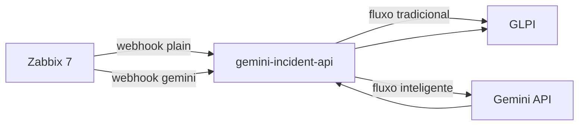

# zabbix-glpi-gemini-incident-lab

Laboratorio didatico de **IA aplicada em Operacoes de TI** com fluxo **real**:

**Zabbix 7 → Webhook → API Python → Gemini API (Free Tier) → GLPI → Chamado enriquecido**

O fluxo principal usa **Gemini real** via `GEMINI_API_KEY`. O modo `mock` existe apenas como fallback opcional.

## Demo em 5 minutos

1. Suba o ambiente:

```bash
cp .env.example .env
# Preencha WEBHOOK_SHARED_SECRET, senhas dos bancos, GEMINI_API_KEY e tokens GLPI
docker compose up -d
```

2. Acompanhe a API:

```bash
docker compose logs -f gemini-incident-api
```

3. Acesse o Zabbix: http://localhost:8080 (credenciais locais em `ZABBIX_USER` / `ZABBIX_PASSWORD`)

4. Acesse o GLPI: http://localhost:8081

5. Dispare alerta tradicional:

```bash
./examples/send_cpu_high_traditional.sh
```

6. Veja o ticket simples no GLPI

7. Dispare alerta com Gemini:

```bash
./examples/send_cpu_high_ai.sh
```

8. Veja o ticket enriquecido no GLPI (resumo, impacto, causa provavel, proximos passos)

9. Compare os dois chamados lado a lado

Com `AUTO_TRIGGER_DEMO_ALERTS=true` (padrao), os passos 5–8 podem ocorrer automaticamente apos o bootstrap.

---

## 1. O que e este projeto

Repositorio unico para palestras e workshops que demonstra:

| Cenario | Host | Fluxo | Resultado no GLPI |
|---------|------|-------|-------------------|
| Automacao tradicional | `srv-linux-traditional` | Zabbix → API → GLPI | Chamado tecnico simples |
| Operacao inteligente | `srv-linux-ai` | Zabbix → API → **Gemini** → GLPI | Chamado com analise operacional |

Hosts sao **fake** (itens Zabbix trapper). Nao e necessario servidor Linux real.

## 2. Arquitetura



Detalhes em [docs/architecture.md](docs/architecture.md).

## 3. Fluxo tradicional vs fluxo com Gemini

| Etapa | Tradicional | Com Gemini |
|-------|-------------|------------|
| Trigger Zabbix | Sim | Sim |
| Webhook | `POST /webhook/zabbix/plain` | `POST /webhook/zabbix/gemini` |
| IA | Nao | Gemini interpreta alerta |
| Titulo GLPI | `[Zabbix] ...` | `[AI/Zabbix] ...` |
| Conteudo | Dados tecnicos do alerta | Dados + resumo, impacto, causa, passos N1/N2 |
| Governanca | Automacao simples | Aviso: validar antes de agir em producao |

## 4. Pre-requisitos

- Docker e Docker Compose v2
- ~4 GB RAM livres
- Conta Google (para chave Gemini no AI Studio)
- Portas locais: `8080` (Zabbix), `8081` (GLPI), `8000` (API)

## 5. Como obter uma GEMINI_API_KEY gratuita

1. Acesse [Google AI Studio](https://aistudio.google.com/apikey)
2. Faca login com sua conta Google
3. Clique em **Create API key**
4. Copie a chave e cole em `GEMINI_API_KEY` no `.env`
5. Mantenha `GEMINI_MODEL=gemini-2.0-flash-lite` (recomendado para o lab)

Guia detalhado: [docs/gemini-api-setup.md](docs/gemini-api-setup.md)

**Aviso Free Tier:** Os limites e condicoes do Free Tier podem mudar. Este projeto nao se responsabiliza por custos caso o usuario altere modelo, habilite billing ou rode uso em alto volume.

## 6. Como configurar .env

```bash
cp .env.example .env
```

Variaveis obrigatorias para o fluxo completo:

```env
WEBHOOK_SHARED_SECRET=
AI_PROVIDER=gemini
GEMINI_API_KEY=
GEMINI_MODEL=gemini-2.0-flash-lite
GLPI_APP_TOKEN=
GLPI_USER_TOKEN=
ZABBIX_DB_PASSWORD=
ZABBIX_DB_ROOT_PASSWORD=
GLPI_DB_PASSWORD=
GLPI_DB_ROOT_PASSWORD=
```

## 7. Como subir o lab

```bash
docker compose up -d
docker compose ps
```

Ordem de inicializacao:

1. Bancos e servicos Zabbix / GLPI
2. `gemini-incident-api`
3. `zabbix-bootstrap` (hosts, template, webhooks, actions)
4. `glpi-bootstrap` (categoria, se tokens existirem)
5. `demo-trigger` (se `AUTO_TRIGGER_DEMO_ALERTS=true`)

Reexecutar bootstrap Zabbix:

```bash
docker compose run --rm zabbix-bootstrap
```

Desativar alertas automaticos na subida:

```env
AUTO_TRIGGER_DEMO_ALERTS=false
```

## 8. Como acessar o Zabbix

| Item | Valor |
|------|-------|
| URL | http://localhost:8080 |
| Usuario | valor de `ZABBIX_USER` no `.env` |
| Senha | valor de `ZABBIX_PASSWORD` no `.env` |

Objetos criados pelo bootstrap:

- Hosts `srv-linux-traditional` e `srv-linux-ai`
- Template `Template Lab Fake Linux Trapper`
- Itens trapper: `cpu.util`, `memory.util`, `disk.util`, `service.status`
- Media Types: `GLPI Traditional Webhook`, `GLPI Gemini Enriched Webhook`

## 9. Como acessar o GLPI

| Item | Valor |
|------|-------|
| URL | http://localhost:8081 |

Na primeira execucao, conclua o instalador web e gere tokens da API: [docs/glpi-api-setup.md](docs/glpi-api-setup.md).

Depois preencha `.env` e reinicie:

```bash
docker compose restart gemini-incident-api
docker compose run --rm glpi-bootstrap
```

## 10. Como disparar alertas

Scripts em `examples/` (enviam valores trapper via `zabbix-sender` no container):

| Cenario | Tradicional | Com Gemini |
|---------|-------------|------------|
| CPU alta | `send_cpu_high_traditional.sh` | `send_cpu_high_ai.sh` |
| Memoria alta | `send_memory_high_traditional.sh` | `send_memory_high_ai.sh` |
| Disco cheio | `send_disk_full_traditional.sh` | `send_disk_full_ai.sh` |
| Servico down | `send_service_down_traditional.sh` | `send_service_down_ai.sh` |

Valores de alerta: `cpu.util=95`, `memory.util=95`, `disk.util=95`, `service.status=0`

## 11. Como comparar os tickets

Abra dois chamados no GLPI:

| Aspecto | Tradicional | Gemini |
|---------|-------------|--------|
| Titulo | `[Zabbix] High - ...` | `[AI/Zabbix] High - ...` |
| Conteudo | Host, trigger, item, valor, link Zabbix | + resumo executivo, impacto, causa, passos N1/N2 |
| Triagem N1 | Interpretacao manual | Rascunho estruturado para validar |
| IA | Nenhuma | Gemini (ou aviso se JSON falhar) |

## 12. Como fazer recovery

```bash
./examples/recover_traditional.sh
./examples/recover_ai.sh
```

Valores de recovery:

```text
cpu.util=20
memory.util=35
disk.util=40
service.status=1
```

## 13. Como usar modo mock (opcional)

Apenas se **nao** tiver chave Gemini:

```env
AI_PROVIDER=mock
GEMINI_API_KEY=
```

```bash
docker compose restart gemini-incident-api
```

A API registra aviso nos logs de que o fluxo enriquecido nao usa Gemini real.

## 14. Troubleshooting

| Sintoma | Causa comum | Acao |
|---------|-------------|------|
| `/health` com `gemini_configured=false` | `GEMINI_API_KEY` vazia | Preencher chave ou usar `AI_PROVIDER=mock` |
| Fluxo Gemini retorna 503 | `AI_PROVIDER=gemini` sem chave | Ver secao 5 |
| `glpi_configured=false` | Tokens GLPI vazios | [docs/glpi-api-setup.md](docs/glpi-api-setup.md) |
| Hosts do lab ausentes | Bootstrap falhou | `docker compose logs zabbix-bootstrap` |
| Script de alerta falha | `zabbix-sender` parado | `docker compose up -d` |
| Ticket nao aparece | GLPI API / tokens | `docker compose logs gemini-incident-api` |
| Dois tickets na subida | `AUTO_TRIGGER_DEMO_ALERTS=true` | Definir `false` no `.env` |

## 15. Seguranca e governanca

- Nunca versione `.env` com credenciais reais (ja esta no `.gitignore`)
- `GEMINI_API_KEY` e tokens GLPI nunca sao logados
- Webhook protegido por `WEBHOOK_SHARED_SECRET` (header `X-Webhook-Token`)
- Chamados enriquecidos incluem: *"Analise gerada por IA para apoio operacional. Validar antes de executar acoes em producao."*
- IA apoia triagem; decisoes operacionais exigem validacao humana

## 16. Roteiro de demonstracao para palestra

Roteiro passo a passo para o apresentador: [docs/demo-script.md](docs/demo-script.md)

---

## API Python

| Metodo | Endpoint | Uso |
|--------|----------|-----|
| `GET` | `/health` | Status e configuracao |
| `POST` | `/webhook/zabbix/plain` | Chamado simples |
| `POST` | `/webhook/zabbix/gemini` | Chamado com Gemini |
| `POST` | `/demo/send-sample/plain?name=` | Demo sem Zabbix (fluxo plain) |
| `POST` | `/demo/send-sample/gemini?name=` | Demo sem Zabbix (fluxo Gemini) |

Teste direto:

```bash
set -a
source .env
set +a

curl -s http://localhost:8000/health | jq .

curl -X POST "http://localhost:8000/demo/send-sample/plain?name=cpu_high" \
  -H "X-Webhook-Token: $WEBHOOK_SHARED_SECRET" | jq .
```

## Estrutura do repositorio

```text
.
├── app/                    # FastAPI + Gemini + GLPI client
│   ├── main.py
│   ├── config.py
│   ├── models.py
│   ├── services/
│   ├── prompts/
│   └── utils/
├── docs/
├── examples/               # Scripts e payloads JSON
├── scripts/
│   ├── bootstrap_zabbix.py
│   ├── bootstrap_glpi.py
│   └── auto_trigger_demo.py
├── docker-compose.yml
└── .env.example
```

## Documentacao adicional

- [docs/gemini-api-setup.md](docs/gemini-api-setup.md) — Chave Gemini
- [docs/glpi-api-setup.md](docs/glpi-api-setup.md) — Tokens GLPI
- [docs/zabbix-webhook-setup.md](docs/zabbix-webhook-setup.md) — Webhooks Zabbix
- [docs/architecture.md](docs/architecture.md) — Arquitetura
- [docs/demo-script.md](docs/demo-script.md) — Roteiro da palestra
