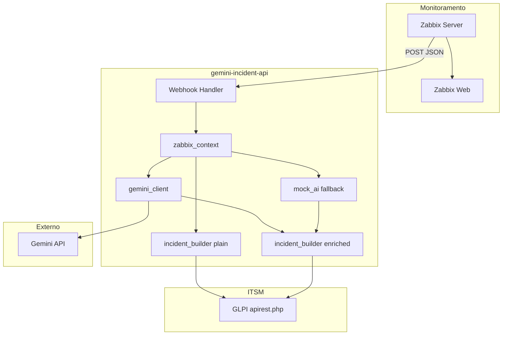

# Arquitetura — zabbix-glpi-gemini-incident-lab

## Visao geral

Laboratorio local que demonstra automacao de incidentes a partir de alertas do Zabbix, com dois niveis de maturidade operacional:

1. **Fluxo plain** — ticket tecnico direto no GLPI (sem IA).
2. **Fluxo enriquecido** — ticket com analise estruturada via **Gemini real** (padrao) ou mock opcional.

## Diagrama textual

```
Zabbix 7 (trapper)
  ↓ trigger + action + webhook (JSON + X-Webhook-Token)
gemini-incident-api (FastAPI)
  ↓ build_alert_context() → AlertContext
  ├─ [plain]  incident_builder → GLPI ticket cru
  └─ [gemini] gemini_client (ou mock_ai) → AIAnalysis → incident_builder → GLPI ticket enriquecido
GLPI apirest.php
  ↓
Ticket para operacao N1/N2
```

## Diagrama (Mermaid)



## Componentes

| Componente | Funcao |
|------------|--------|
| `zabbix-server` | Processa triggers e gera eventos |
| `zabbix-web` | UI e configuracao de Media Type / webhook |
| `zabbix-sender` | Container utilitario para scripts `examples/` |
| `gemini-incident-api` | Recebe webhook, orquestra fluxos |
| `zabbix-bootstrap` | Provisiona hosts, template, webhooks, actions |
| `glpi-bootstrap` | Valida API GLPI e categoria |
| `demo-trigger` | Envia `cpu.util=95` aos dois hosts se `AUTO_TRIGGER_DEMO_ALERTS=true` |
| `zabbix_context.py` | Normaliza payload em `AlertContext` |
| `gemini_client.py` | Analise via `google-genai` quando `AI_PROVIDER=gemini` |
| `mock_ai.py` | Fallback didatico local |
| `glpi_client.py` | Sessao REST e criacao de Ticket |
| `incident_builder.py` | Monta titulo e HTML do chamado |

## Endpoints

| Metodo | Rota | Descricao |
|--------|------|-----------|
| GET | `/health` | Saude e flags de configuracao |
| POST | `/webhook/zabbix/plain` | Ticket sem IA |
| POST | `/webhook/zabbix/gemini` | Ticket enriquecido com Gemini |
| POST | `/demo/send-sample/plain` | Demo com JSON de `examples/` |
| POST | `/demo/send-sample/gemini` | Demo fluxo Gemini |

## Seguranca

- `WEBHOOK_SHARED_SECRET` validado via header `X-Webhook-Token` ou campo `secret` no JSON.
- Tokens GLPI e `GEMINI_API_KEY` nunca sao logados (`mask_secret`).
- `.env` nao versionado; usar `.env.example`.

## Rede Docker

Rede `zabbix-glpi-gemini-lab-net`. A API acessa GLPI em `http://glpi/apirest.php` e recebe webhooks do Zabbix em `http://gemini-incident-api:8000`.
